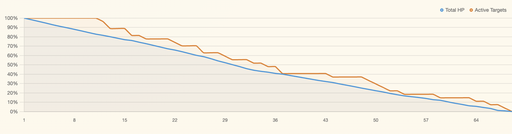
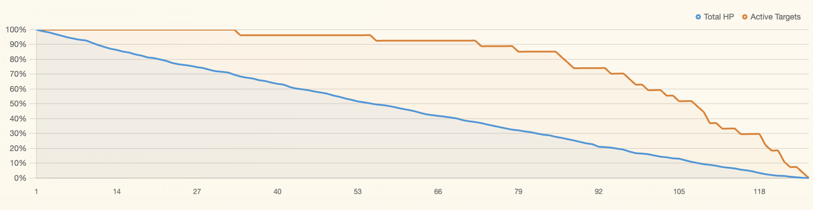
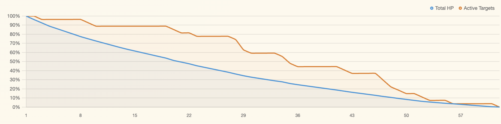
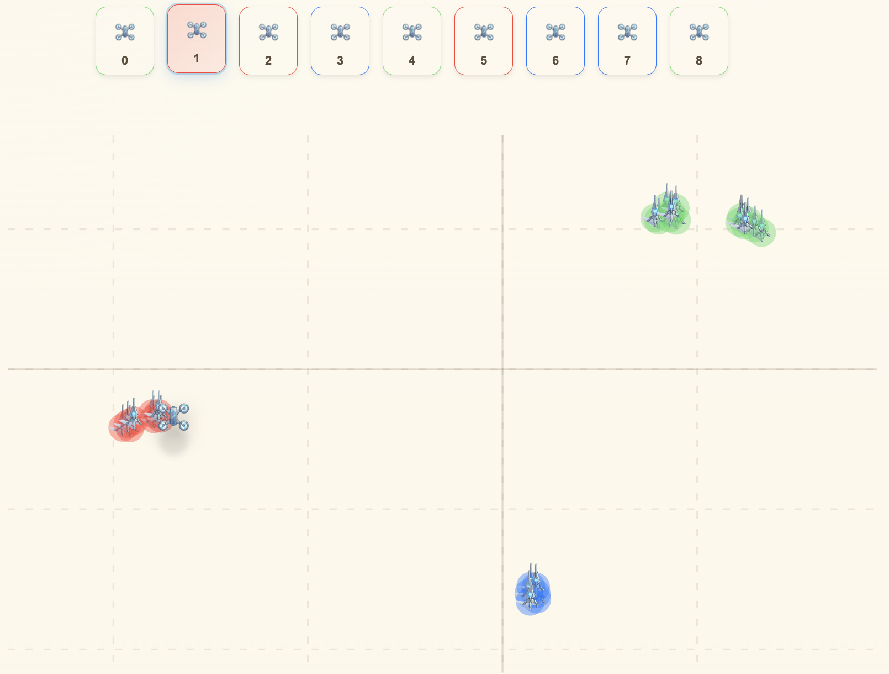

# 7. Results

This section reports the results of the evaluation described in Section 6. It presents task-completion outcomes, cross-policy comparisons, learning dynamics, latent-structure recovery, coordination effects, and the convergence assessment for the decentralized matrix-factorization policy.

## 7.1 Task Completion

All three policies — random, oracle, and matrix-factorization — successfully neutralized all 27 targets in their respective evaluation episodes. The task-completion criterion is therefore not a differentiating signal in this experiment: the MF policy achieved 100% success in all 35 training episodes, and both the random and oracle baselines succeeded in their single evaluation episodes.

This result is consistent with the scenario design. With 9 drones engaging 27 targets over a maximum of 250 steps, even a uniformly random policy accumulates sufficient damage to neutralize all targets before the step budget is exhausted. The informative comparison across policies lies entirely in efficiency: how quickly and with how much total effort was full task completion achieved. All subsequent analysis therefore focuses on efficiency and coordination quality metrics rather than completion rate.

## 7.2 Cross-Policy Comparison

The table below reports each metric for the random baseline, the oracle benchmark, and the matrix-factorization policy at its best episode by step count (episode 32). The baseline and oracle are each evaluated on a single episode; the matrix-factorization result reflects accumulated learning over 35 training episodes. For interpretation, average match quality measures the fraction of best-matched-drone damage realized by the actual drone-target pairings, while total latent mismatch measures the cumulative damage shortfall relative to that same best-matched-drone reference.

| Metric | Random | MF (ep. 32) | Oracle | MF vs. Random | MF vs. Oracle |
|---|---|---|---|---|---|
| Steps | 126 | **67** | 62 | −46.8% | +8.1% |
| Total ammo | 1,134 | **603** | 558 | −46.8% | +8.1% |
| Shots per target | 42.0 | **22.3** | 20.7 | −46.9% | +8.1% |
| Avg. match quality | 0.308 | **0.550** | 0.654 | +78.2% | −15.9% |
| Total latent mismatch (HP) | 628.7 | **235.9** | 145.2 | −62.5% | +62.4% |
| Total overkill (HP) | 7.0 | **7.84** | 3.65 | +12.1% | +114.8% |
| Total collisions | 225 | **296** | 382 | +31.6% | −22.5% |
| Total net damage (HP) | 270.0 | **270.0** | 270.0 | 0% | 0% |
| Targets neutralized | 27 | **27** | 27 | 0% | 0% |

*Table 1. Efficiency metrics (Steps, Total ammo, Shots per target, Latent mismatch, Overkill) should ideally be low; Quality metrics (Match quality, Targets neutralized) should be high. Collisions and Net damage are diagnostic indicators. Percentage columns show MF performance relative to each baseline — for efficiency metrics, negative values indicate improvement (lower is better); for quality metrics, positive values indicate improvement (higher is better).*

In this configuration, the MF policy recovers most of the efficiency gap between random and oracle, reducing the step and ammo counts from 126 / 1,134 (random) to 67 / 603 (MF), compared with the oracle's 62 / 558. This places the learned policy within 8% of the oracle on both efficiency metrics. Average match quality improves from 0.308 (random) to 0.550 (MF), closing 70% of the gap to the oracle value of 0.654. Total latent mismatch is reduced by 62.5% relative to random, from 628.7 HP to 235.9 HP, though a substantial residual gap to the oracle (145.2 HP) remains.

Net damage is identical across all three policies, as all episodes result in full target neutralization. This confirms that the relevant variation is not in whether damage is applied, but in how efficiently it is allocated.

**Note on reward versus damage.** The MF policy optimizes angular alignment between drone and target latent vectors (cosine reward), not physical damage directly. The efficiency gains reported above — reduced steps, improved match quality — are downstream consequences of better angular alignment, not of an objective that explicitly minimizes engagement time or damage waste. This distinction is central to interpreting the results: the policy learns *which targets suit which drones*, and faster task completion follows as a consequence, rather than being optimized for directly.

Two metrics move against the direction of improvement. Total overkill increases from 4.6 HP in episode 1 to 8.95 HP in episode 35, and at the best episode (ep. 32) is slightly higher under MF (7.84 HP) than under random (7.0 HP), while the oracle achieves far lower overkill (3.65 HP). Total collisions under MF (296) exceed the random baseline (225). Both findings are analyzed in Section 7.6.

## 7.3 Episode Engagement Profiles

A complementary view is provided by per-episode engagement profiles, which plot the fraction of total HP remaining (blue) and active targets remaining (orange) over time for each policy. Table 1 uses the best MF episode by step count (episode 32, 67 steps) for the quantitative comparison, whereas Figure 1 uses the final training episode (episode 35, 68 steps) because it better illustrates the learned engagement geometry at the end of training; the two episodes are qualitatively similar. The gap between the curves indicates how much damage has been spread across still-active targets without yet producing eliminations.

| MF Policy (ep. 35, 68 steps) | Random Baseline (126 steps) | Oracle Benchmark (62 steps) |
|:---:|:---:|:---:|
|  |  |  |
 
 *Figure 1. Engagement profiles by policy — Total HP (blue) and Active Targets (orange) as a percentage of initial values, plotted over episode timesteps.*

**Random baseline (126 steps).** The random profile shows the widest and most persistent gap between the two curves. HP declines approximately linearly while the Active Targets curve remains near 100% until roughly the mid-30s, and the curves converge only near the end of the episode. This is consistent with **distributed spray damage**: fire is spread broadly, delaying eliminations and matching the high latent mismatch reported in §7.2.

**Matrix-factorization policy (68 steps).** The MF profile narrows the HP-Active Targets gap substantially. Eliminations begin around step 12, and the Active Targets curve then descends in a relatively steady staircase pattern throughout the episode. The remaining gap indicates imperfect focus fire: the policy concentrates on high-affinity targets, but some damage is still spread across targets before eliminations occur.

**Oracle benchmark (62 steps).** The oracle profile finishes in the fewest steps and begins eliminating targets within the first few steps. Visually, however, the two curves do not remain as tightly coupled as in the MF profile: the Active Targets curve moves in larger drops separated by plateaus, indicating burst-like eliminations rather than a strictly sequential pattern.

**Structural interpretation.** In these representative episodes, random shows the broadest damage spread, MF shows the closest visual coupling between HP loss and eliminations, and oracle achieves the shortest completion time with more burst-like elimination phases. The figure therefore complements the numeric results in §7.2 rather than duplicating them directly.

## 7.4 Learning Dynamics Across 35 Episodes

The matrix-factorization policy's 35-episode trajectory suggests three broad phases: rapid early convergence, a mid-training plateau with crowding, and a slow late refinement. Table 2 shows selected episodes from the run.

| Episode | Steps | Total Ammo | Shots / Target | Avg Match Quality | Collisions |
|---:|---:|---:|---:|---:|---:|
| 1 | 184 | 1,656 | 61.3 | 0.205 | 318 |
| 5 | 174 | 1,566 | 58.0 | 0.234 | 319 |
| 9 | 111 | 999 | 37.0 | 0.372 | 574 |
| 12 | 103 | 927 | 34.3 | 0.397 | 579 |
| 15 | 77 | 693 | 25.7 | 0.505 | 344 |
| 18 | 73 | 657 | 24.3 | 0.523 | 359 |
| 21 | 75 | 675 | 25.0 | 0.512 | 355 |
| 25 | 70 | 630 | 23.3 | 0.539 | 339 |
| 30 | 70 | 630 | 23.3 | 0.531 | 292 |
| 32 | **67** | **603** | **22.3** | **0.550** | 296 |
| 35 | 68 | 612 | 22.7 | **0.587** | 294 |

*Table 2. Selected episodes illustrating the three learning phases of the matrix-factorization policy. Bold values mark the best step count (episode 32) and best match quality (episode 35). All episodes achieved full target neutralization (27/27).*

**Phase 1 — Rapid Convergence (episodes 1–9).** Steps drop 40% (184 → 111) and match quality rises from 0.205 to 0.372 as the interaction matrix fills rapidly; by episode 3, all drone-target pairs have been explored at least once.

**Phase 2 — Mid-Training Plateau with Crowding (episodes 9–21).** Improvement slows as steps settle near the mid-70s and match quality oscillates around 0.50–0.53. Collisions peak at 629 (episode 10), consistent with multiple agents converging on the same high-affinity targets and creating temporary contention.

**Phase 3 — Slow Late Refinement (episodes 21–35).** Efficiency improves gradually again: steps fall to 67 and match quality reaches its training peak of 0.587 at episode 35. The late-stage gains are modest but consistent with continued refinement rather than full saturation.

## 7.5 Latent Structure Recovery

Several indicators suggest that the policy is recovering the hidden compatibility structure from interaction outcomes alone. Over training, actual pairings move closer to best-match behavior, predicted utilities move closer to observed interaction outcomes, and the model becomes more confident in its top-ranked target choices. Taken together, these trends indicate that the embeddings are no longer behaving like a sparse memory of past rewards; they are beginning to encode a usable compatibility geometry.

**Geometric structure in the learned embeddings.** Figure 2 shows a t-SNE projection of drone 1's learned P (drone) and U (target) embedding vectors at episode 35, colored post-hoc by ground-truth latent mode.

*Figure 2. t-SNE projection of drone 1's learned P and U embedding matrices at episode 35. Each point represents either a drone (P-row) or a target (U-column) in the 3-dimensional factorization space. Colors correspond to ground-truth latent mode assignments (red, green, blue), which are unknown to the policy and applied here post-hoc for interpretability.*

By episode 35, the learned embeddings are no longer scattered randomly: they organize into a small number of separated regions that broadly align with the three ground-truth latent modes, even though the policy never receives mode labels or latent vectors. This is important behaviorally. It suggests that the policy is not merely memorizing individual drone-target outcomes, but is recovering a coarser structure that groups similar drones and targets together and supports better generalization across interactions. The separation is not perfect, and t-SNE is only an illustrative projection, so the figure should be read as qualitative support rather than proof on its own.

Overall, the learning dynamics in this section are consistent with partial latent-structure recovery: the policy learns enough of the hidden compatibility geometry to improve pairing decisions substantially, but not enough to eliminate the remaining gap to the oracle. Whether this behavior persists across other seeds, noise levels, and swarm compositions is addressed in Section 8.

## 7.6 Coordination Dynamics

**Collisions.** Collisions peak at 629 (episode 10) during the crowding phase, then decline to 294 by episode 35 — higher than random (225) but lower than the oracle (382). The oracle's higher count reflects *deliberate* multi-drone focus-fire; MF collisions are a byproduct of independent agents converging on similar greedy choices — contention, not coordination.

**Overkill.** Total overkill increases over training (4.6 HP at episode 1 → 8.95 HP at episode 35), the opposite direction from improvement. As the policy routes more drones to high-affinity targets, shots land on already-neutralized targets within the same timestep. Without HP visibility (a core ZK constraint), the policy cannot schedule fire to avoid this waste — unlike the oracle (3.65 HP), which incorporates remaining HP directly. This is a genuine limitation of the ZK-constrained design, not a transient artifact.

## 7.7 Limitations of the Current Evaluation

The results reported above are based on a single benchmark configuration: one scenario seed, one swarm composition (9 drones, 27 targets), one latent dimension ($d = 3$), one target HP level (10.0), one noise setting (reward and observation noise both 0.2), one supervision mode (integration-matrix), and one set of learning hyperparameters. While the findings are internally consistent across the metrics and learning phases examined, they do not yet establish generality across any of these axes. In particular:

- **Statistical reproducibility** has not been assessed. The reported results reflect a single scenario seed (seed 42); variation across problem instances is unknown.
- **Supervision mode**: only integration-matrix supervision is evaluated. The direct supervision mode remains untested.
- **Hyperparameter sensitivity**: the factorization dimension $d_f = 3$ matches the true latent dimension $d = 3$. Performance under mismatched $d_f$ has not been characterized.
- **Noise robustness**: only one noise level is tested. The operating envelope of the policy under higher or lower noise is unknown.
- **Scaling**: the 3:1 target-to-drone ratio and 9-drone swarm are fixed. Whether the approach scales to larger or differently composed swarms is an open question.

These limitations are addressed in the experimental roadmap outlined in Section 8.

## 7.8 Convergence Assessment

The training run is assessed as **potentially undertrained**. The best episode by step count is episode 32 (67 steps, tied with episode 33), occurring three episodes before the end of the run, while the best match quality (0.587) is achieved in the final episode (episode 35). Neither efficiency nor match quality shows signs of stabilization at the end of training: episode duration remained near its minimum across the final phase, while match quality continued to rise through the final episode with no plateau in evidence. The exploration rate at the end of training ($\varepsilon = 0.054$) remains substantially above the specified minimum of $\varepsilon_{\min} = 0.02$, indicating that the policy had not yet entered its fully exploitative regime.

The average performance over the full 35-episode training run ($\bar{T} = 97.6$ steps with standard deviation 39.6 across episodes, $\bar{A} = 878.7$ shots with standard deviation 356.1) is considerably below the best-episode results (67 steps, 603 shots), reflecting the large variance during the early rapid-convergence phase. Cross-policy comparisons using the best episode therefore represent the ceiling of what the policy achieved under the given training budget, not its steady-state behavior.

These observations suggest that extending the training horizon would likely yield further efficiency gains, particularly in match quality and latent mismatch. The policy has not saturated, and the structural dynamics — declining agreement gap, recovering preference diversity — indicate that learning is ongoing. Convergence behavior under extended training is identified as a primary question for future investigation.
