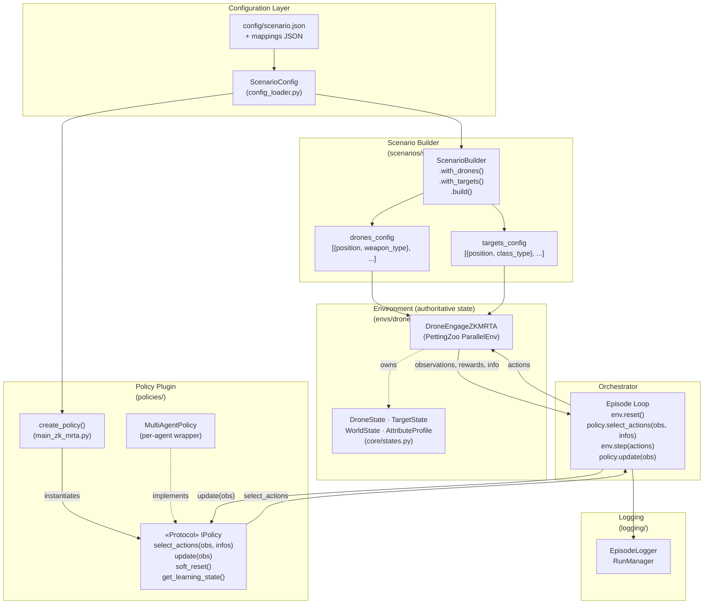

# TabulaDrone — Design Reference

> **Scope:** This document covers only the critical API contracts needed to integrate with TabulaDrone — write a new policy, build a scenario, or wire an episode loop. Policy algorithm internals are intentionally excluded.

---

## 0. High-Level Design

TabulaDrone is built around a **strict bipartite architecture**: the simulation environment owns all world state and enforces all rules; the policy is an external, interchangeable plugin that only receives observations and returns actions. Neither side imports the other.

The system has five structural layers:

- **Configuration** — a typed `ScenarioConfig` tree (loaded from JSON) that provides mappings (class → attributes, weapon → damage profile), scenario parameters, and policy hyperparameters to all other layers.
- **Scenario Builder** — constructs randomized, spatially-constrained `drones_config` and `targets_config` lists before the environment is instantiated.
- **Environment** (`DroneEngageZKMRTA`) — the authoritative PettingZoo `ParallelEnv`. Owns `DroneState`, `TargetState`, and `WorldState`. Produces ZK-constrained observations and computes rewards. Never references any policy.
- **Policy Plugin** (`IPolicy`) — a structural `Protocol`. Receives observations, returns actions. May maintain internal learning state. Has no access to environment internals.
- **Orchestrator** (`main_zk_mrta.py`) — the runtime bridge. Instantiates the environment and the policy via `create_policy()`, then drives the episode loop. The only layer that references both sides.



### Key Design Rules

- **Environment never imports a policy.** The only connection is through the observation/action dicts at the `IPolicy` boundary.
- **Policies never access environment internals.** They see only what the observation space exposes — target positions/status, previous actions, and noisy rewards.
- **`create_policy()` is the only policy-aware code.** It is isolated in the orchestrator and returns a plain `IPolicy`. The episode loop is fully policy-agnostic.
- **ZK constraints are enforced by the observation space.** Target attributes, class types, and weapon damage profiles are never included in observations.

---

### ASCII Diagram

For plain-text viewers:

```
┌─────────────────────────────────────────────────────────────────────────────────┐
│                              CONFIGURATION LAYER                                  │
│  ┌─────────────────────┐    ┌─────────────────────────────────────────────────┐ │
│  │ config/scenario.json│    │ config/mappings.json                            │ │
│  │ + PolicyConfig      │    │ • class_attribute_mapping                       │ │
│  │ + ExecutionConfig   │    │ • weapon_damage_profile_mapping                 │ │
│  └──────────┬──────────┘    └─────────────────────────────────────────────────┘ │
│             │                                                                     │
│             v                                                                     │
│  ┌───────────────────────────────────────────────────────────────────────────┐  │
│  │ ScenarioConfig (config_loader.py) - Typed dataclass tree                 │  │
│  └──────────────────────┬────────────────────────────────────────────────────┘  │
└─────────────────────────┼─────────────────────────────────────────────────────────┘
                          │
                          ├──────────────────────────────┐
                          │                              │
                          v                              v
┌─────────────────────────────────────────┐  ┌─────────────────────────────────────┐
│       SCENARIO BUILDER LAYER            │  │         POLICY FACTORY              │
│  tabula_drone/scenarios/                │  │  main_zk_mrta.py                    │
│                                         │  │                                     │
│  ScenarioBuilder                        │  │  create_policy(policy_type, config, │
│  ├── .with_drones(count, region, ...)   │  │            drones_config,           │
│  ├── .with_targets(count, region, ...)  │  │            num_targets)           │
│  └── .build()                           │  │            -> IPolicy               │
│       │                                 │  │                                     │
│       v                                 │  │  • random                           │
│  drones_config  targets_config          │  │  • min_ttk_oracle                   │
│  [{position,     [{position,            │  │  • max_damage_oracle                │
│    weapon_type},   class_type}, ...]    │  │  • ucb_cf                           │
│    ...]           ...]                  │  │  • selfish_ep_greedy_cf            │
│                                         │  │  • coordinated_ep_greedy_cf        │
│  Used by: Environment init              │  │                                     │
└──────────┬──────────────────────────────┘  └────────────┬────────────────────────┘
           │                                             │
           │                                             │ (returns IPolicy object)
           │                                             │
           v                                             v
┌──────────────────────────────────────────────────────────────────────────────────┐
│                              ORCHESTRATOR LAYER                                   │
│                          main_zk_mrta.py                                         │
│                                                                                   │
│   ┌─────────────────┐         ┌─────────────────┐         ┌─────────────────┐   │
│   │   Episode Loop  │         │    Policy       │         │   EpisodeLogger │   │
│   │                 │<───IPolicy interface─────>│         │    RunManager   │   │
│   │  obs, info =    │  select_actions()       │         │                 │   │
│   │  env.reset() ───┼─────────────────────────┼─────────┼── start_episode │   │
│   │       │         │         │       │         │         │                 │   │
│   │       v         │         │       │         │         │                 │   │
│   │  actions = ─────┼────────>│       │         │         │                 │   │
│   │  policy.        │         │       │         │         │                 │   │
│   │  select_        │         │       │         │         │                 │   │
│   │  actions(obs)   │         │       │         │         │                 │   │
│   │       │         │         │       │         │         │                 │   │
│   │       v         │         │       │         │         │                 │   │
│   │  obs, rewards,──┼────────>│       │         │         │                 │   │
│   │  terminations,  │         │  policy.update(obs)      │                 │   │
│   │  truncations,   │         │       │         │         │                 │   │
│   │  info =         │         │       │         │         │                 │   │
│   │  env.step(      │         │       │         │         │                 │   │
│   │    actions)     │         │       │         │         │                 │   │
│   │       │         │         │       │         │         │                 │   │
│   │       └─────────┴────────>│       └────────>│         │   log_step()    │   │
│   │              (loop until done)              │         │   end_episode() │   │
│   └─────────────────┘         └─────────────────┘         └─────────────────┘   │
│                                                                                   │
└──────────────────────────┬──────────────────────────────────────────────────────┘
                           │
                           │ uses
                           v
┌──────────────────────────────────────────────────────────────────────────────────┐
│                          ENVIRONMENT LAYER (authoritative state)                │
│              tabula_drone/envs/drone_engage_zk_mrta_v0.py                          │
│                                                                                   │
│   ┌────────────────────────────────────────────────────────────────────────────┐  │
│   │                     DroneEngageZKMRTA (PettingZoo ParallelEnv)               │  │
│   │                                                                            │  │
│   │   ┌─────────────────────────────────────────────────────────────────────┐  │  │
│   │   │                    OWNED STATE (core/states.py)                      │  │  │
│   │   │                                                                      │  │  │
│   │   │  ┌────────────────┐  ┌────────────────┐  ┌──────────────────────────┐  │  │  │
│   │   │  │  DroneState    │  │  TargetState   │  │     WorldState          │  │  │  │
│   │   │  │  • position    │  │  • position    │  │  • world_size           │  │  │  │
│   │   │  │  • weapon_type │  │  • class_type  │  │  • time_step            │  │  │  │
│   │   │  │  • damage_     │  │  • attributes  │  │  • max_steps            │  │  │  │
│   │   │  │    profile     │  │    (Attribute  │  │  • scenario_id          │  │  │  │
│   │   │  │  • ammo_used   │  │    Profile)    │  │  • seed                 │  │  │  │
│   │   │  └────────────────┘  └────────────────┘  └──────────────────────────┘  │  │  │
│   │   │                                                                        │  │  │
│   │   └────────────────────────────────────────────────────────────────────────┘  │  │
│   │                                                                                │  │
│   │   ┌─────────────────────────────────────────────────────────────────────┐    │  │
│   │   │                    OBSERVATION SPACE (ZK-constrained)                │    │  │
│   │   │                                                                       │    │  │
│   │   │  Dict {                                                               │    │  │
│   │   │    "targets": Box([t0_x, t0_y, t0_active, ...])    ← positions only  │    │  │
│   │   │    "selected_targets": Box(prev_actions[0..N])    ← collaborative    │    │  │
│   │   │    "observed_rewards": Box(noisy_rewards[0..N])   ← collaborative    │    │  │
│   │   │  }                                                                    │    │  │
│   │   │                                                                       │    │  │
│   │   │  ⚠️  NEVER includes: target attributes, classes, weapon profiles       │    │  │
│   │   │                                                                       │    │  │
│   │   └───────────────────────────────────────────────────────────────────────┘    │  │
│   │                                                                                │  │
│   │   ┌─────────────────────────────────────────────────────────────────────┐    │  │
│   │   │                    ACTION SPACE                                      │    │  │
│   │   │  Discrete(num_targets + 1)                                           │    │  │
│   │   │    0 = NoOp, 1..N = fire at target index                             │    │  │
│   │   └───────────────────────────────────────────────────────────────────────┘    │  │
│   │                                                                                │  │
│   └────────────────────────────────────────────────────────────────────────────────┘  │
└──────────────────────────────────────────────────────────────────────────────────────┘

```

---

## 1. State Primitives

**Source:** `tabula_drone/core/states.py`

These dataclasses are the shared language between the environment and any consumer (loggers, orchestrators). They are owned exclusively by the environment and must not be mutated outside of `DroneEngageZKMRTA.step()`.

### `DroneState`

```python
@dataclass
class DroneState:
    id: str
    position: Tuple[float, float]
    ammo_used: int                    # running count of shots fired (starts at 0)
    weapon_type: str                  # e.g. "light", "medium", "heavy"
    damage_profile: Dict[str, float]  # hidden from agents in ZK environments
```

### `TargetState`

```python
@dataclass
class TargetState:
    id: str
    position: Tuple[float, float]
    class_type: str                   # e.g. "A", "B", "C"
    attributes: AttributeProfile      # multi-attribute health profile
    is_active: bool = True            # False once all attributes depleted
```

### `AttributeProfile`

Owns the multi-attribute HP model. A target is neutralized when **all** attributes reach zero.

```python
@dataclass
class AttributeProfile:
    attributes: Dict[str, float]        # current values (mutable)
    initial_values: Dict[str, float]    # original values at creation (immutable reference)

    def apply_damage(self, damage_profile: Dict[str, float]) -> None:
        """Reduce each named attribute by the corresponding damage value. Clamps at 0."""
        ...

    def is_depleted(self) -> bool:
        """True if ALL attributes are <= 0."""
        ...

    def get_total(self) -> float:
        """Sum of all current attribute values."""
        ...
```

### `WorldState`

```python
@dataclass
class WorldState:
    world_size: Tuple[float, float]  # (width, height) bounds
    time_step: int                   # current step index
    max_steps: int                   # maximum steps per episode
    scenario_id: str
    seed: Optional[int] = None
```

---

## 2. Environment Interface

**Source:** `tabula_drone/envs/drone_engage_zk_mrta_v0.py`

### Reward Mode

A module-level constant controls reward calculation. Change it before instantiating the environment.

```python
# tabula_drone/envs/drone_engage_zk_mrta_v0.py
REWARD_MODE = "HP_REDUCTION"  # options: "HP_REDUCTION" | "DOMINANT_ATTRIBUTE" | "ATTRIBUTE_ALIGNMENT"
```

### Constructor

```python
class DroneEngageZKMRTA(ParallelEnv):
    def __init__(
        self,
        world_size: Tuple[float, float] = (1000.0, 1000.0),
        max_steps: int = 100,
        drones_config: List[Dict[str, Any]] = None,    # [{"position": (x,y), "weapon_type": str}, ...]
        targets_config: List[Dict[str, Any]] = None,   # [{"position": (x,y), "class_type": str}, ...]
        scenario_id: str = "zk_mrta_baseline",
        class_attribute_mapping: Dict[str, Dict[str, float]] = None,    # required
        weapon_damage_profile_mapping: Dict[str, Dict[str, float]] = None,  # required
        policy_type: str = "random",     # ⚠️ vestigial — not used internally, safe to ignore
        reward_noise: float = 0.0,       # Gaussian σ on own reward observation
        observation_noise: float = 0.0,  # additional Gaussian σ on other agents' reward observations
    ): ...
```

### Observation Space (per agent)

The environment always produces Dict observations. Both `selected_targets` and `observed_rewards` are populated from the previous step (zeros on `reset`).

```python
observation_spaces = {
    agent_id: spaces.Dict({
        "targets": spaces.Box(
            low=0.0, high=np.inf,
            shape=(3 * num_targets,),   # [t0_x, t0_y, t0_active, t1_x, t1_y, t1_active, ...]
            dtype=np.float32
        ),
        "selected_targets": spaces.Box(
            low=0, high=num_targets,
            shape=(num_drones,),         # previous step action of every drone (0=NoOp)
            dtype=np.int32
        ),
        "observed_rewards": spaces.Box(
            low=-np.inf, high=np.inf,
            shape=(num_drones,),         # previous step rewards, with configurable noise
            dtype=np.float32
        ),
    })
    for agent_id in possible_agents
}
```

### Action Space (per agent)

```python
action_spaces = {
    agent_id: spaces.Discrete(num_targets + 1)
    # 0      → NoOp
    # 1..N   → fire at target index (1-indexed)
}
```

### `reset`

```python
def reset(
    self,
    seed: Optional[int] = None,
    options: Optional[Dict[str, Any]] = None,
) -> Tuple[Dict[str, Any], Dict[str, Dict[str, Any]]]:
    """
    Returns:
        observations: Dict[agent_id → obs_dict]
        infos:        Dict[agent_id → info_dict]
    """
```

### `step`

```python
def step(
    self,
    actions: Dict[str, int],   # {agent_id: action}
) -> Tuple[
    Dict[str, Any],    # observations
    Dict[str, float],  # rewards  (+ve = effective shot, -1.0 = wasted on neutralized target)
    Dict[str, bool],   # terminations  (True when all targets neutralized)
    Dict[str, bool],   # truncations   (True when max_steps reached)
    Dict[str, Dict[str, Any]],  # infos keyed by agent_id
]:
```

---

## 3. Policy Plugin Contract

**Source:** `tabula_drone/policies/base.py`

All policies — swarm-level or per-agent wrapped — must satisfy this `Protocol`. Structural typing: no inheritance required.

```python
@runtime_checkable
class IPolicy(Protocol):

    is_deterministic: bool  # class attribute; True if no randomness

    def select_actions(
        self, obs: Dict[str, Any], info: Dict[str, Any]
    ) -> Dict[str, int]:
        """Given observations and info (both keyed by agent_id), return {agent_id: action}."""
        ...

    def update(self, obs: Dict[str, Any]) -> None:
        """Called after each env.step() with the new observations. No-op for stateless policies."""
        ...

    def soft_reset(self) -> None:
        """Called between episodes. Clears episode-level state; preserves learned parameters."""
        ...

    def get_learning_state(self) -> Optional[Dict[str, Any]]:
        """Returns internal learning state for logging. None for non-learning policies."""
        return None
```

---

## 4. Integration Glue

### 4a. Policy Factory

**Source:** `main_zk_mrta.py`

The factory is the only place that references concrete policy types. The episode loop only ever sees `IPolicy`.

```python
def create_policy(
    policy_type: str,          # "random" | "min_ttk_oracle" | "max_damage_oracle"
                               # | "ucb_cf" | "selfish_ep_greedy_cf" | "coordinated_ep_greedy_cf"
    config: ScenarioConfig,
    drones_config: List[Dict[str, Any]],
    num_targets: Optional[int] = None,
) -> IPolicy:
    """
    Dispatches to the concrete policy class and returns an IPolicy-compliant object.
    Per-agent CF policies are automatically wrapped in MultiAgentPolicy.
    """
```

### 4b. Multi-Agent Wrapper

**Source:** `tabula_drone/policies/multi_agent_policy.py`

Used when each drone needs its own private state (e.g. latent vectors). Wraps a `Dict[agent_id → per-agent policy]` into a single `IPolicy` object.

```python
class MultiAgentPolicy(IPolicy):
    def __init__(self, policies: Dict[str, BaseCFAgentPolicy]):
        """
        policies: {agent_id → per-agent policy instance}
        Delegates select_actions → each agent's select_action(obs)
        Delegates update       → each agent's update_from_observation(obs)
        """

    def select_actions(
        self, obs: Dict[str, Any], info: Dict[str, Any]
    ) -> Dict[str, int]:
        """Calls self.policies[agent_id].select_action(agent_obs) for each agent."""
        ...
```

### 4c. Episode Loop

**Source:** `main_zk_mrta.py` — `run_episode()`

The canonical interaction pattern. The environment and policy are fully decoupled; only `IPolicy` methods are called.

```python
obs, infos = env.reset()

while not done:
    reference_agent_id = env.agents[0]
    actions = policy.select_actions(obs, infos)          # IPolicy boundary
    obs, rewards, terminations, truncations, infos = env.step(actions)
    policy.update(obs)                                   # IPolicy boundary

    terminated = terminations[reference_agent_id]
    truncated  = truncations[reference_agent_id]
    done = terminated or truncated

policy.soft_reset()                                      # between episodes
```

---

## 5. Scenario Construction

**Source:** `tabula_drone/scenarios/scenario_builder.py`

Generates randomized, spatially-constrained drone and target configs before the environment is instantiated. Uses a fluent builder API.

```python
class ScenarioBuilder:
    def __init__(
        self,
        world_size: Tuple[float, float],
        seed: Optional[int] = None,
        class_attribute_mapping: Dict[str, Dict[str, float]] = None,        # required
        weapon_damage_profile_mapping: Dict[str, Dict[str, float]] = None,  # required
    ): ...

    def with_drones(
        self,
        count: int,
        region: Tuple[Tuple[float, float], Tuple[float, float]],  # ((x_min_frac, x_max_frac), (y_min_frac, y_max_frac))
        min_distance_between_drones: float,
        weapon_distribution: Dict[str, float],  # e.g. {"light": 0.2, "medium": 0.5, "heavy": 0.3}
    ) -> "ScenarioBuilder": ...

    def with_targets(
        self,
        count: int,
        region: Tuple[Tuple[float, float], Tuple[float, float]],
        class_distribution: Dict[str, float],   # e.g. {"A": 0.3, "B": 0.4, "C": 0.3}
        min_distance_from_drones: float,
        min_distance_between_targets: float,
    ) -> "ScenarioBuilder": ...

    def build(self) -> Tuple[List[Dict[str, Any]], List[Dict[str, Any]]]:
        """
        Returns (drones_config, targets_config).
        drones_config:  [{"position": (x, y), "weapon_type": str}, ...]
        targets_config: [{"position": (x, y), "class_type": str}, ...]
        Generation order: drone positions → weapon assignment → target positions → class assignment.
        """
        ...
```

**Typical wiring:**

```python
builder = ScenarioBuilder(
    world_size=config.world.size,
    seed=config.seed,
    class_attribute_mapping=config.mappings.class_attribute_mapping,
    weapon_damage_profile_mapping=config.mappings.weapon_damage_profile_mapping,
)
builder.with_drones(count=..., region=..., min_distance_between_drones=..., weapon_distribution=...)
builder.with_targets(count=..., region=..., class_distribution=..., min_distance_from_drones=..., min_distance_between_targets=...)
drones_config, targets_config = builder.build()
```
