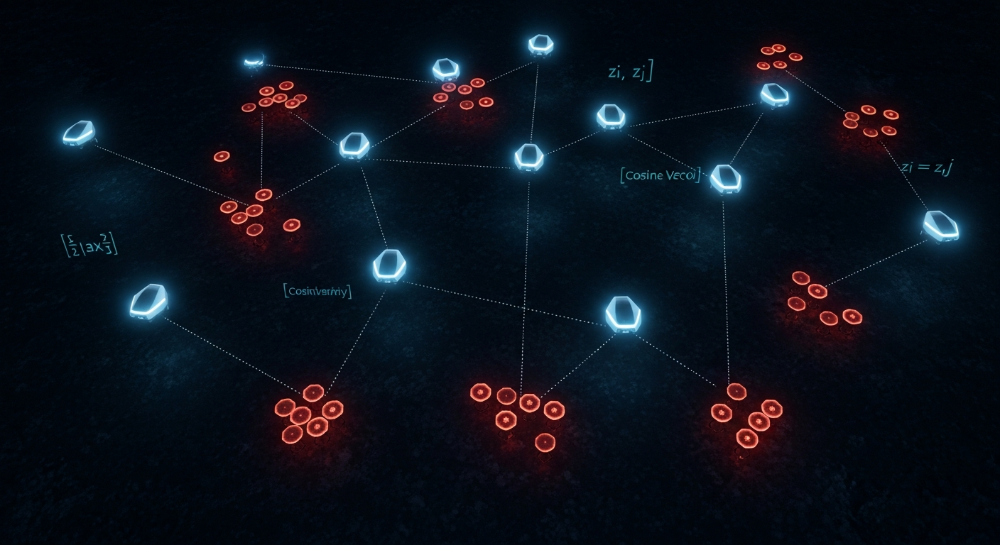

# Zero-Knowledge Swarm Coordination

**Decentralized drone task allocation with no communication, no priors, and no shared state**



---

## What is this?

Most multi-robot coordination research assumes agents can talk to each other, know their own capabilities, or at least know something about the tasks they are solving. This project removes all three.

**Zero-Knowledge Multi-Robot Task Allocation (ZK-MRTA)** is a problem setting where a swarm of drones must allocate themselves to targets under the strictest possible informational constraints:

- No agent knows the properties of any target
- No agent knows its own capabilities or effectiveness
- No agent knows anything about the other agents
- No direct communication is permitted

All an agent ever sees is a public broadcast of what the swarm did last step and what reward each drone received. From that alone, the swarm must learn to coordinate.

The question this research asks: *can meaningful, emergent coordination arise from nothing but interaction outcomes?*

---

## The Core Idea

Each drone independently runs a **matrix factorization model** — the same idea behind collaborative filtering in recommendation systems, but repurposed for online latent-utility estimation.

Drones play the role of users. Targets play the role of items. Engagement outcomes replace ratings.

Because the public broadcast exposes what every drone did and what reward it got, each drone can update its local model not just from its own shots, but from every observed swarm interaction. No parameters are shared. No messages are passed. Collaboration emerges only through a shared observation stream.

Over episodes, each drone's private model learns a compressed representation of the hidden compatibility geometry — which drones are effective against which targets — and begins routing itself accordingly.

```
Hidden environment:         drone i has latent vector z_i
                            target j has latent vector z_j
                            compatibility g_ij = z_i · z_j  (never observed)

Reward to drone i           r_ij = cosine(z_i, z_j)         (noisy, observed)
for engaging target j:

Each drone k learns:        P[k] (drone embeddings)  +  U (target embeddings)
                            predicted utility = P[k][i] · U[j]
                            updated online via SGD from public interaction trace
```

---

## Key Contributions

**1. Problem formalization.** ZK-MRTA is defined as a distinct class of multi-robot task allocation problems, with formal constraints on observability, communication, and prior knowledge. It fills a gap between classical MRTA (which assumes known costs and feasibility) and standard MARL (which typically allows communication or shared rewards).

**2. Decentralized matrix-factorization policy.** A collaborative-filtering-inspired policy that each agent runs independently, learning latent compatibility structure from sparse public interaction traces without parameter exchange.

**3. Benchmark environment.** A configurable PettingZoo/Gymnasium environment that enforces ZK observability constraints, generates episodes with hidden drone-target compatibility structure, and logs policy-agnostic metrics for systematic comparison.

**4. Empirical evaluation.** Preliminary results on a 9-drone, 27-target scenario show the MF policy closing ~92% of the efficiency gap between a random baseline and a privileged oracle, recovering embedding structure aligned with hidden compatibility modes.

---

## Results Snapshot

Single seed (seed 42), 35 training episodes, 9 drones, 27 targets, latent dim = 3.

| Metric | Random | MF Policy | Oracle |
|---|---|---|---|
| Steps to completion | 126 | **67** | 62 |
| Total shots fired | 1,134 | **603** | 558 |
| Avg. match quality | 0.308 | **0.550** | 0.654 |
| Total latent mismatch (HP) | 628.7 | **235.9** | 145.2 |

The MF policy reduces episode length by 47% relative to random and sits within 8% of the oracle — an agent with full privileged access to all hidden state.

By episode 35, the learned embeddings form separated clusters that align with the three ground-truth latent compatibility modes, even though mode labels were never provided.

---

## The ZK Constraint in Practice

The oracle knows the latent vectors, the remaining HP on every target, and can plan a globally optimal assignment each step. The MF policy knows none of that. Its only inputs are:

- which targets are still active (binary flags)
- the spatial positions of targets
- last step's joint action vector (noisy)
- last step's per-agent reward vector (noisy)

The result is a characteristic tradeoff: the MF policy improves match quality and cuts episode length substantially, but generates more overkill (shots landing on targets neutralized in the same step) and more crowding (multiple drones converging on the same high-affinity target) than the oracle. Both are structural consequences of the ZK constraint — the policy cannot see remaining HP and cannot coordinate explicitly.

---

## Project Structure

```
ColabDroneSwarm/
├── tabula_drone/               # Python simulation package
│   ├── envs/                   # PettingZoo environment (ZK-MRTA)
│   ├── policies/               # Random, Oracle, MatrixFactorization
│   ├── scenarios/              # Latent scenario builder (hidden compatibility)
│   ├── logging/                # Episode + engagement loggers
│   └── utils/                  # Metrics, console rendering
├── tabula_viewer/              # Angular visualization app
│   └── src/app/components/
│       ├── paper/              # Tabbed paper reader (rendered HTML sections)
│       ├── map/                # Live 2D swarm map
│       ├── embedding-visualization/   # 3D embedding renderer
│       ├── integration-matrix/        # Running interaction matrix heatmap
│       └── report/             # Cross-episode metrics report
├── docs/academic-paper/        # Paper source (Markdown per section)
├── config/scenario.json        # Scenario configuration
├── main_zk_mrta.py             # Main runner
└── tests/
```

---

## Running

**Prerequisites:** Python 3.11+

```bash
pip install -r requirements.txt
```

**Run the benchmark** (all configured policies, all episodes):

```bash
python main_zk_mrta.py
```

Configuration is in [`config/scenario.json`](config/scenario.json). Key fields:

```json
{
  "seed": 42,
  "policy": { "type": ["random", "max_damage_oracle", "matrix_factorization_cf"] },
  "drones": { "count": 9 },
  "targets": { "count": 27 },
  "environment": { "episodic": { "num_episodes": 35 } },
  "collaborative_filtering": {
    "matrix_factorization_cf": {
      "latent_dim": 3,
      "learning_rate": 0.01,
      "use_integration_matrix": true
    }
  }
}
```

**Launch the viewer** (requires Node.js / Angular CLI):

```bash
cd tabula_viewer
ng serve
```

Then open `http://localhost:4200`. The viewer includes a tabbed paper reader, live swarm map, embedding visualizer, and episode comparison reports.

---

## Experimental Roadmap

The current results are preliminary (single seed). The planned evaluation extends to:

1. **Multi-seed paired benchmark** — 20 seeds, all three policies, reproducibility assessment
2. **Supervision mode ablation** — direct reward vs. integration-matrix smoothing
3. **Latent-dimension sensitivity** — factorization rank vs. hidden environment rank
4. **Noise sensitivity** — separate sweeps for observation noise and reward noise
5. **Swarm-scale scaling** — 3:9, 6:18, 9:27, 15:45 drone-target configurations

---

## Paper

The full paper is readable section by section in the viewer, or as Markdown under [`docs/academic-paper/`](docs/academic-paper/).

Sections: Abstract · Introduction · Literature Review · Model and Problem Definition · Methods · Framework Description · Experiments · Results · Next Steps

---

## License

MIT
