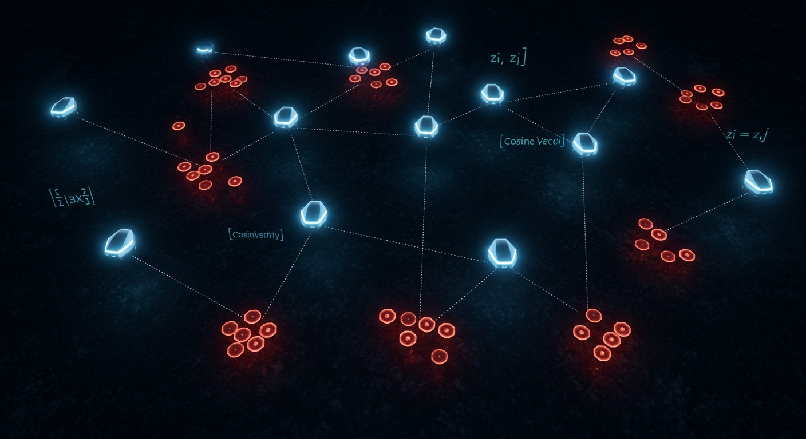

# Acting on the Unseen: Communication-Free Collaborative Filtering for Decentralized Multi-Robot Task Allocation

**Zero-Knowledge MRTA (ZK-MRTA):** decentralized multi-robot task allocation under
the least possible information: no prior knowledge (not even the latent rank), zero
communication, only a partial and privately-noisy view of teammates' outcomes, and
fully distributed decisions.



> **Paper (live):** https://apartsinprojects.github.io/ZKDroneSwarm/
> **Follow-up (refinements):** https://apartsinprojects.github.io/ZKDroneSwarm/ras_paper2.html
> **Extended tutorial (with proofs):** https://apartsinprojects.github.io/ZKDroneSwarm/tutorial.html

---

## Three names, one story

- **ZK-MRTA** (the problem): Zero-Knowledge Multi-Robot Task Allocation. A hidden,
  low-rank robot x task reward governs which robot suits which task; there is no
  communication, no task model, not even the rank, and each robot sees only a
  persistent, partial, per-observer-noisy slice of a public outcome stream.
- **SwarmCF** (the method): a decentralized, online, low-rank collaborative filter
  that each robot runs over the passive broadcast, with a constant-time fold-in that
  lets it act on tasks it never attempted.
- **LatentSwarm** (the software): an open, modular Python package for ZK-MRTA,
  comprising an analytical masked-broadcast harness (the headline results) and an
  independent environment that adds capacity-1 contention.

## The setting in one breath

A swarm must repeatedly choose which task to take, under minimal information:

- **No prior knowledge:** no labels, no task models, no known latent structure, not
  even the true rank of the problem.
- **Zero communication:** no messages, no parameter sharing, no coordinator, no
  consensus. Agents only PASSIVELY SENSE a public stream of outcomes.
- **Partial, noisy observation:** each agent senses a masked (persistent Bernoulli
  rate rho), per-observer-noisy slice of the public outcomes; no two agents ever see
  the same stream.
- **Fully distributed decisions:** every agent decides alone, from its own private
  state.

**The question:** can such a swarm still act intelligently, in particular on tasks it
has never tried? **Yes**, by running online collaborative filtering over the public
outcome stream, with an advantage that is *categorical* (proven), not a few percent.

## Why it works (one paragraph)

Compatibility between agents and tasks is hidden but low-rank (a few latent factors
explain it), and there are far more tasks than rounds (`n >> T`). A structure-free
learner that estimates a task only from its own attempts is, on any task it never
tried, at the prior-mean error floor, which dominates under scarcity. Collaborative
filtering recovers the shared task factors from the public broadcast, so each agent
can complete its OWN value for tasks it never touched. The result is a per-agent
sample-complexity separation of `Theta(d)` (CF) versus `Theta(n)` (structure-free),
categorical on unseen pairs (error to 0 versus a constant floor).

## Headline results

- **Acting on the unseen (categorical).** SwarmCF acts well on never-engaged
  agent-task pairs at every broadcast rate; structure-free learners sit at the floor
  by construction.
- **A positive scaling law.** Per-robot competence on unseen tasks rises as the team
  grows: the swarm gets smarter as it gets bigger.
- **Anytime / operational.** On reward actually earned over time, SwarmCF dominates
  at every horizon; per-arm bandits stay near random because, with `n >> T`, they
  never stop exploring.
- **Masking-robust, recovers a centralized ceiling.** Online weighted-ALS is robust
  to observation masking (batch-SVD hybrids decay) and recovers most of a centralized
  full-communication ceiling; the batch variant SwarmCF-batch wins only at full
  broadcast.
- **Theory (with proofs).** A structure-free floor (Proposition 1) plus four
  theorems: `Theta(d)` row completion, anytime separation under scarcity, a
  deterministic decentralized-recovery condition, and a collective-speedup law.
- **Validated in LatentSwarm.** In the independent `latentswarm` package (signed
  low-rank reward, persistent partial + private broadcast, task scarcity, capacity-1
  contention), SwarmCF leads on earned skill (0.42 of the Hungarian ceiling) and is the
  only method with unseen-pair skill above the floor (0.58); MF-SGD 0.20 / 0.09;
  structure-free at the floor. Robust to the guessed rank (graceful degradation below d,
  flat above).

## Methods (all strictly zero-knowledge, fully distributed)

The methods are one family, SwarmCF, differing only along a few axes. The base paper
uses the core estimator; the follow-up studies the refinements.

| method | what it adds | role |
|---|---|---|
| SwarmCF | online weighted-ALS on the public broadcast | core method (base paper) |
| SwarmCF-batch | SVD warm-start + batch refit | strong batch variant; wins at full broadcast |
| SwarmCF-B | Bayesian posterior over factors; confidence-directed exploration | refinement (follow-up) |
| SwarmCF-D+ | scarcity-gated private offset for capacity-1 contention | refinement (follow-up) |
| SwarmCF-Ch | choice channel only (noise-immune) | refinement (follow-up) |
| SwarmCF-B-ARD | rank self-determination (removes the guessed rank) | refinement (follow-up) |

Each agent runs its own online estimator (a masked event gets zero weight, not zero
value), with estimation separated from the decision policy. No parameters are shared;
collaboration emerges only through the public observation stream.

## Documents

- **Paper** (RAS, single-column): `docs/ras_paper.html` (also the GitHub Pages
  landing page, `docs/index.html`;
  [live](https://apartsinprojects.github.io/ZKDroneSwarm/))
- **Follow-up** (refinements): `docs/ras_paper2.html`
  ([live](https://apartsinprojects.github.io/ZKDroneSwarm/ras_paper2.html))
- **Extended tutorial** (step by step, with proofs and figures): `docs/tutorial.html`
  ([live](https://apartsinprojects.github.io/ZKDroneSwarm/tutorial.html))
- **Experiment log / data catalogue / backlog / plan:** `docs/PROJECT_LOG.md`,
  `docs/DATA_CATALOGUE.md`, `docs/BACKLOG.md`, `docs/EXPERIMENT_PLAN.md`

## Reproducibility

All numbers come from per-seed JSON in `results/pilots/` (registry in
`docs/DATA_CATALOGUE.md`). Regenerate the figures and pages:

```bash
python experiments/make_figures.py        # figures -> docs/figures/
python experiments/make_ras_paper.py      # docs/ras_paper.html + docs/index.html
python experiments/make_ras_paper2.py     # docs/ras_paper2.html
python -m latentswarm.run                 # LatentSwarm package validation -> results/pilots/latentswarm_main.json
python experiments/ranksweep.py           # rank-guess robustness (Figure F21)
```

The analytical masked-broadcast harness and our methods and baselines live in
`experiments/` (the core world / reward / oracle, the SwarmCF family, and the
structure-free and low-rank baselines). The **`latentswarm/`** package is the modular,
pluggable ZK-MRTA suite used in Section 6.5 (separate `config` / `scenarios` / `env` /
`algorithms` / `metrics` / `viz` modules, registered by name; `pip install -e .`, tests in
`latentswarm/tests/`). The older `tabula_drone/` package is **deprecated** and superseded by
`latentswarm/`. Every method uses a guessed rank and broadcast-only inputs; the Oracle is used
only to normalize scores.

## Authors

- **Alexander Apartsin** (corresponding author), Afeka Tel Aviv Academic College of
  Engineering
- **Yigal Meshulam**, Afeka Tel Aviv Academic College of Engineering
- **Yehudit Aperstein**, Afeka Tel Aviv Academic College of Engineering

## License

MIT
